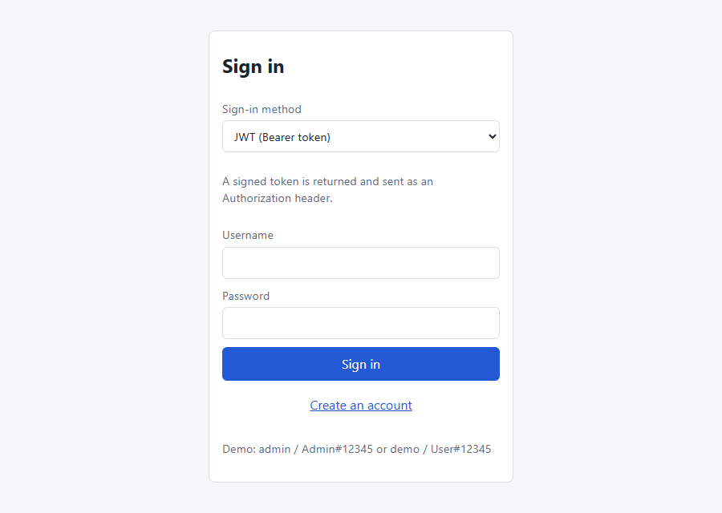
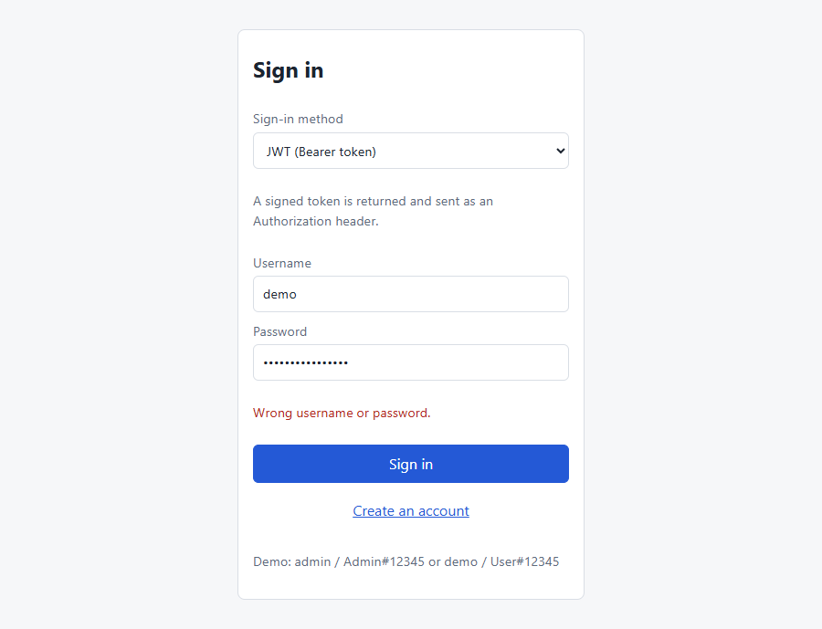
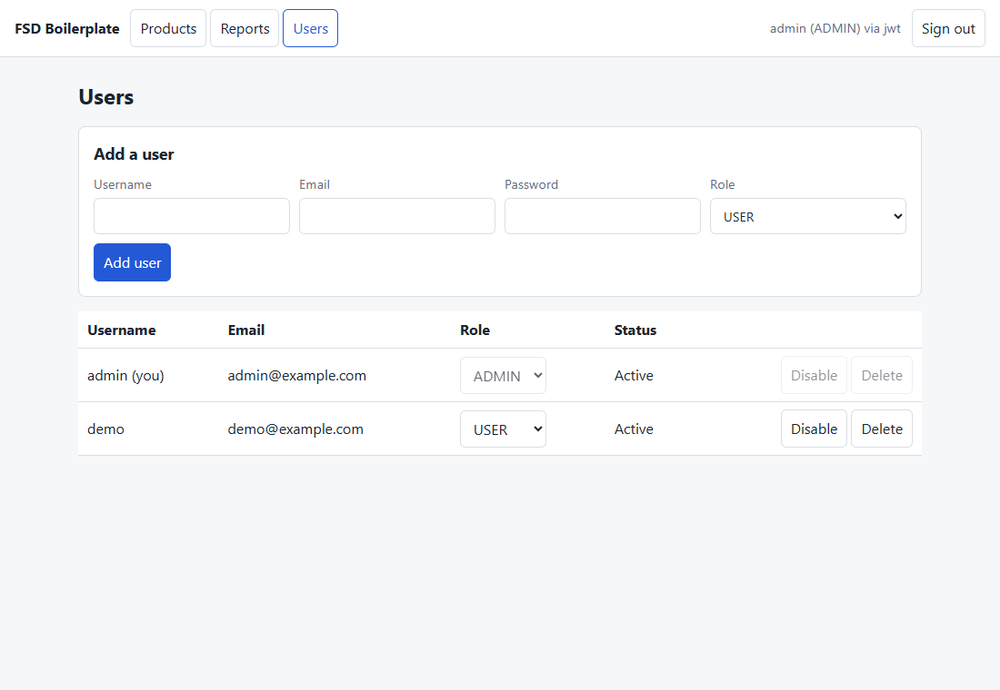
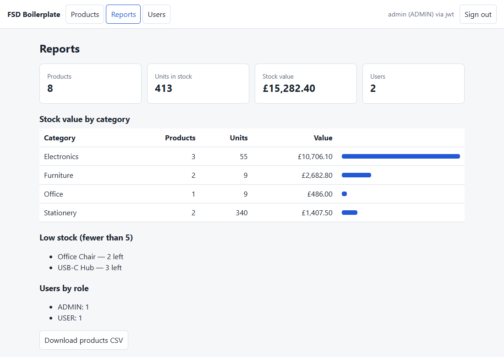
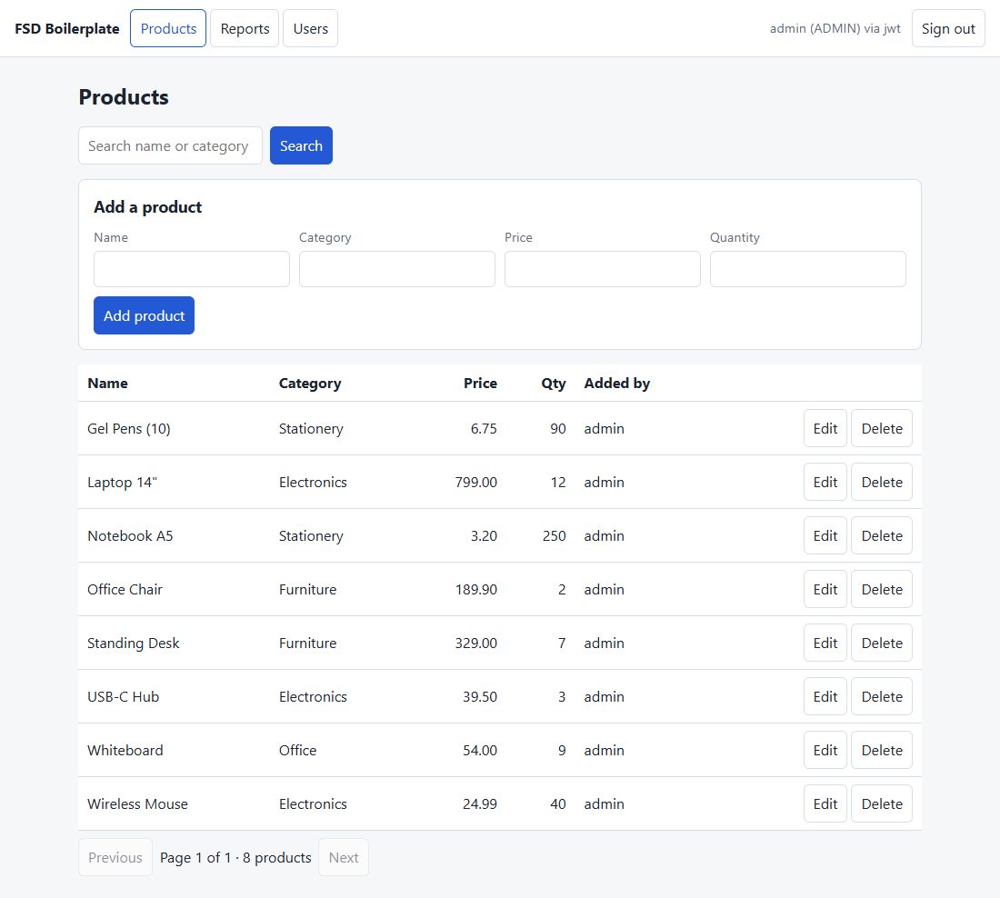
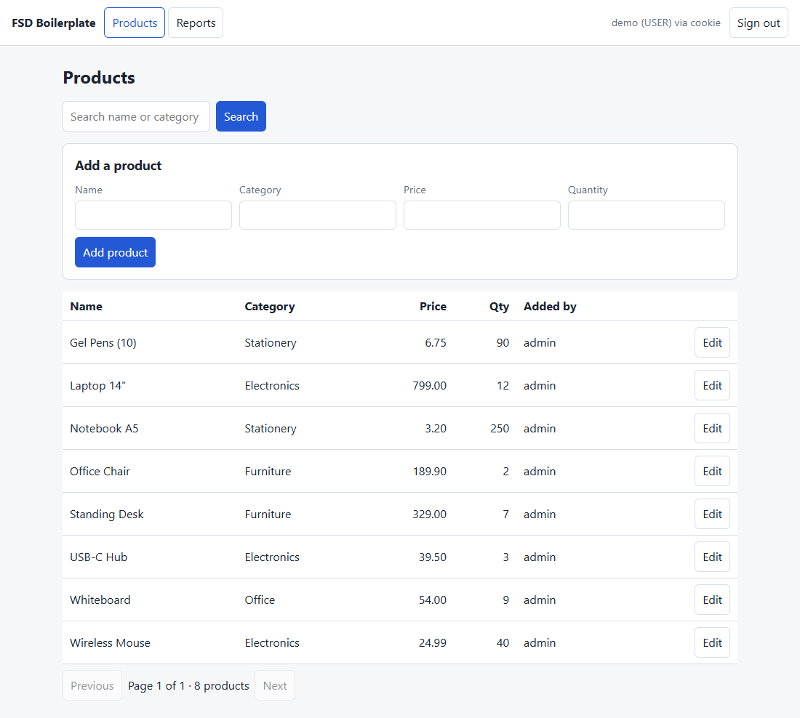

# PWC_Capstone_template

Boilerplate and planning material for the CRM capstone. This page explains what is in the repository,
what every file is for, what has been verified, and where to start.

- [1. What is in this repository](#1-what-is-in-this-repository)
- [2. Where to start](#2-where-to-start)
- [3. nimbus_crm: the backend boilerplate](#3-nimbus_crm-the-backend-boilerplate)
- [4. Frontend brief for students](#4-frontend-brief-for-students-nimbus_crmdocs)
- [5. fsd-boilerplate: React + Spring Boot sample](#5-fsd-boilerplate-react--spring-boot--mysql-sample)
- [6. Root files](#6-root-files)
- [7. What is verified and what is not](#7-what-is-verified-and-what-is-not)
- [8. Development credentials and secrets](#8-development-credentials-and-secrets)
- [9. UI reference screenshots](#9-ui-reference-screenshots)

## 1. What is in this repository

| Folder or file | What it is | Status |
|---|---|---|
| [nimbus_crm](nimbus_crm) | **.NET 10 + MySQL 8 backend boilerplate.** Register, sign in and sign out (JWT, HttpOnly cookie or server session behind one rule), CSRF protection, USER and ADMIN roles, an admin user list, four reports with CSV export, an EF Core schema for users, accounts, contacts, deals and activities, development sample data, helper scripts and tests. | Built. 82 automated tests pass against a real MySQL; a scripted live proof ran against the running API. |
| [nimbus_crm/docs](nimbus_crm/docs) | **The frontend brief for students**, in a detailed and a simple version. | Written. |
| [fsd-boilerplate](fsd-boilerplate) | **React + Spring Boot + MySQL full-stack sample**: login (JWT, cookie, session), products CRUD, user administration, reports with CSV. | Run end to end on a throwaway MySQL (API with `curl`, UI in a real browser) with 10 screenshots. Automated tests: only 5 JWT unit tests. |
| [plan.md](plan.md) | Step-by-step plan for finishing the projects. | Working document. |

What this repository is **not**: there is no frontend for `nimbus_crm`, and `nimbus_crm` has no API yet for
creating or editing accounts, contacts, deals or activities (their tables exist and the reports read them).
The original capstone starter and its mentor material are not published here.

## 2. Where to start

| You are... | Read this |
|---|---|
| A student building the frontend | [nimbus_crm/docs/boilerplate-and-frontend-tasks.simple.md](nimbus_crm/docs/boilerplate-and-frontend-tasks.simple.md) first, then the [detailed version](nimbus_crm/docs/boilerplate-and-frontend-tasks.detailed.md) |
| Running the backend | [nimbus_crm/README.md](nimbus_crm/README.md) |
| Looking at the Java sample | [fsd-boilerplate/README.md](fsd-boilerplate/README.md) |
| Reviewing progress | [plan.md](plan.md), and section 7 below |

Quick start for the backend (needs the .NET 10 SDK and a local MySQL 8; Windows PowerShell):

```powershell
cd nimbus_crm
powershell -ExecutionPolicy Bypass -File .\scripts\setup-dev.ps1     # creates the database and stores secrets
dotnet ef database update -p src/Infrastructure -s src/Api            # creates the tables
dotnet run --project src/Api --launch-profile http                    # http://localhost:5090
```

`GET http://localhost:5090/health` should answer `Healthy`. API docs are at `/scalar` in Development.

## 3. nimbus_crm: the backend boilerplate

Four projects in a clean layering. Dependencies only point inward: `Api` -> `Application`, `Infrastructure`;
`Infrastructure` -> `Application`; `Application` -> `Domain`; `Domain` depends on nothing.

### 3.1 Solution-level files

| File | What it does |
|---|---|
| [nimbus_crm.slnx](nimbus_crm/nimbus_crm.slnx) | The solution: the four projects under `src/` and the two test projects under `tests/`. |
| [Directory.Build.props](nimbus_crm/Directory.Build.props) | Settings shared by every project: .NET 10, nullable reference types on, implicit usings, and **warnings are build errors**. |
| [.gitignore](nimbus_crm/.gitignore) | Keeps build output (`bin`, `obj`), editor files and any `.env` file out of git. |
| [README.md](nimbus_crm/README.md) | Setup, the three sign-in modes, CSRF, roles, reports, tests, production settings and known limits. |

### 3.2 Scripts ([nimbus_crm/scripts](nimbus_crm/scripts))

| File | What it does |
|---|---|
| [setup-dev.ps1](nimbus_crm/scripts/setup-dev.ps1) | One-time local setup. Creates the `nimbus_crm` database and the `crm_app` MySQL user, then stores the connection string and a random JWT signing key in `dotnet user-secrets`. You type the passwords; nothing is written to a file in the repo. |
| [reset-mysql-root.ps1](nimbus_crm/scripts/reset-mysql-root.ps1) | Sets a new local MySQL root password when the old one is lost, using MySQL's documented `init-file` method. Needs Administrator rights. `-DryRun` shows what it found and changes nothing. |
| [auth-proof.sh](nimbus_crm/scripts/auth-proof.sh) | Runs against a **running** API and prints every curl command with its response: register, each sign-in mode alone, all three together, CSRF refusals, sign-out and replay of old credentials, and USER / ADMIN / anonymous on an admin endpoint. |

### 3.3 Domain ([src/Domain](nimbus_crm/src/Domain)): the data model, no dependencies

| File | What it does |
|---|---|
| [Entities/User.cs](nimbus_crm/src/Domain/Entities/User.cs) | A person who signs in: username, email, password hash, role, active flag, failed-login count and lockout end time. |
| [Entities/Account.cs](nimbus_crm/src/Domain/Entities/Account.cs) | A company. Has many contacts. |
| [Entities/Contact.cs](nimbus_crm/src/Domain/Entities/Contact.cs) | A person at an account. Has many deals and many activities. |
| [Entities/Deal.cs](nimbus_crm/src/Domain/Entities/Deal.cs) | An opportunity driven by one contact: title, value in GBP, expected close date, stage, closed date, lost reason. |
| [Entities/Activity.cs](nimbus_crm/src/Domain/Entities/Activity.cs) | A call, email, meeting or note logged against a contact **by a user**. |
| [Entities/RevokedToken.cs](nimbus_crm/src/Domain/Entities/RevokedToken.cs) | A signed-out JWT or cookie id, kept until it would have expired anyway. |
| [Enums/UserRole.cs](nimbus_crm/src/Domain/Enums/UserRole.cs), [ContactStatus.cs](nimbus_crm/src/Domain/Enums/ContactStatus.cs), [DealStage.cs](nimbus_crm/src/Domain/Enums/DealStage.cs), [ActivityType.cs](nimbus_crm/src/Domain/Enums/ActivityType.cs) | The fixed lists: roles (USER, ADMIN), contact status (Prospect, Customer, Churned), deal stages (Prospecting, Qualified, Proposal, Negotiation, Won, Lost) and activity types (Call, Email, Meeting, Note). |
| [NimbusCrm.Domain.csproj](nimbus_crm/src/Domain/NimbusCrm.Domain.csproj) | Project file. |

### 3.4 Application ([src/Application](nimbus_crm/src/Application)): what the system does

Commands and queries run through Mediator; every command is validated first by FluentValidation.

| File | What it does |
|---|---|
| [Abstractions/IApplicationDbContext.cs](nimbus_crm/src/Application/Abstractions/IApplicationDbContext.cs) | The slice of the database the handlers use. Implemented by Infrastructure. |
| [Abstractions/IPasswordHasher.cs](nimbus_crm/src/Application/Abstractions/IPasswordHasher.cs) | Hash a password and verify one (answers success, failure, or "right password but rehash it"). |
| [Abstractions/ITokenService.cs](nimbus_crm/src/Application/Abstractions/ITokenService.cs) | Issues a JWT for a user. |
| [Abstractions/ITokenRevocationList.cs](nimbus_crm/src/Application/Abstractions/ITokenRevocationList.cs) | Remembers signed-out credentials until they expire. |
| [Abstractions/ICredentialValidator.cs](nimbus_crm/src/Application/Abstractions/ICredentialValidator.cs) | The per-request check that the user behind a credential still exists, is active, has the same role, and the credential was not signed out. |
| [Auth/Register/RegisterCommand.cs](nimbus_crm/src/Application/Auth/Register/RegisterCommand.cs) | Register: validation rules, duplicate checks, always creates a plain USER. |
| [Auth/Login/LoginCommand.cs](nimbus_crm/src/Application/Auth/Login/LoginCommand.cs) | Sign in: checks the password, counts failures, applies the account lockout, upgrades old password hashes. |
| [Auth/LockoutPolicy.cs](nimbus_crm/src/Application/Auth/LockoutPolicy.cs) | How many wrong passwords lock an account and for how long. |
| [Auth/AuthErrors.cs](nimbus_crm/src/Application/Auth/AuthErrors.cs) | The business errors: username taken, email taken, invalid credentials (one message for every sign-in failure). |
| [Auth/UserDto.cs](nimbus_crm/src/Application/Auth/UserDto.cs) | What the API shows about a user. There is deliberately no password field. |
| [Users/ListUsersQuery.cs](nimbus_crm/src/Application/Users/ListUsersQuery.cs) | The paged admin user list, with bounded page and size. |
| [Reports/GetDealsByStageQuery.cs](nimbus_crm/src/Application/Reports/GetDealsByStageQuery.cs) | Count and total value per stage, one `GROUP BY` in MySQL; all six stages appear. |
| [Reports/GetContactsPerAccountQuery.cs](nimbus_crm/src/Application/Reports/GetContactsPerAccountQuery.cs) | Contacts per account, biggest first; accounts with none show 0. |
| [Reports/GetActivitiesPerUserQuery.cs](nimbus_crm/src/Application/Reports/GetActivitiesPerUserQuery.cs) | Activities logged per user, most active first. |
| [Reports/GetUsersByRoleQuery.cs](nimbus_crm/src/Application/Reports/GetUsersByRoleQuery.cs) | User counts per role (ADMIN only at the endpoint). |
| [Reports/ReportRows.cs](nimbus_crm/src/Application/Reports/ReportRows.cs) | The row shapes the four reports return. |
| [Behaviors/ValidationBehavior.cs](nimbus_crm/src/Application/Behaviors/ValidationBehavior.cs) | Runs the validators before any handler; a failure becomes a 400 with field-level errors. |
| [Common/Result.cs](nimbus_crm/src/Application/Common/Result.cs) | A success-or-business-error result, so expected failures are not exceptions. |
| [DependencyInjection.cs](nimbus_crm/src/Application/DependencyInjection.cs) | Registers all validators. |
| [NimbusCrm.Application.csproj](nimbus_crm/src/Application/NimbusCrm.Application.csproj) | Project file. |

### 3.5 Infrastructure ([src/Infrastructure](nimbus_crm/src/Infrastructure)): MySQL and security plumbing

| File | What it does |
|---|---|
| [Persistence/CrmDbContext.cs](nimbus_crm/src/Infrastructure/Persistence/CrmDbContext.cs) | The EF Core database context for all six tables. |
| [Persistence/Configurations/](nimbus_crm/src/Infrastructure/Persistence/Configurations) | One configuration file per entity (`User`, `Account`, `Contact`, `Deal`, `Activity`, `RevokedToken`): maximum length on every string, indexes for search and paging, stage and role stored as text, money as `decimal(18,2)`. |
| [Persistence/Migrations/](nimbus_crm/src/Infrastructure/Persistence/Migrations) | The generated `InitialCreate` migration and its model snapshot: the whole schema. |
| [Persistence/UtcDateTimeConverter.cs](nimbus_crm/src/Infrastructure/Persistence/UtcDateTimeConverter.cs) | MySQL stores no time zone, so dates read back are marked UTC and serialize with a trailing `Z`. |
| [Persistence/DuplicateKey.cs](nimbus_crm/src/Infrastructure/Persistence/DuplicateKey.cs) | Recognises MySQL's "duplicate entry" error so the API answers 409 instead of 500. |
| [Security/IdentityPasswordHasher.cs](nimbus_crm/src/Infrastructure/Security/IdentityPasswordHasher.cs) | Password hashing with ASP.NET Core Identity's PBKDF2-HMAC-SHA512 at 220,000 iterations. No custom crypto. |
| [Security/DatabaseTokenRevocationList.cs](nimbus_crm/src/Infrastructure/Security/DatabaseTokenRevocationList.cs) | Signed-out credentials stored in the `RevokedTokens` table, so a restart does not revive them. |
| [Security/CredentialValidator.cs](nimbus_crm/src/Infrastructure/Security/CredentialValidator.cs) | The per-request "is this user still active with this role" check (cached for 30 seconds). |
| [Security/RevokedTokenCleaner.cs](nimbus_crm/src/Infrastructure/Security/RevokedTokenCleaner.cs) | Background job that deletes expired revoked-credential rows hourly. |
| [Seeding/DevelopmentSeeder.cs](nimbus_crm/src/Infrastructure/Seeding/DevelopmentSeeder.cs) | In Development only, on empty tables: creates one ADMIN, one USER and the sample data. |
| [Seeding/SampleData.cs](nimbus_crm/src/Infrastructure/Seeding/SampleData.cs) | The fixed sample data: 8 accounts, 20 contacts, 18 deals across all six stages and 30 activities. |
| [DependencyInjection.cs](nimbus_crm/src/Infrastructure/DependencyInjection.cs) | Registers the database (connection string passed in from configuration), the hasher, revocation list and validator. |
| [NimbusCrm.Infrastructure.csproj](nimbus_crm/src/Infrastructure/NimbusCrm.Infrastructure.csproj) | Project file (MySQL provider for EF Core 10). |

### 3.6 Api ([src/Api](nimbus_crm/src/Api)): the HTTP surface

| File | What it does |
|---|---|
| [Program.cs](nimbus_crm/src/Api/Program.cs) | Wires everything together: logging, error handling, authentication, rate limiting, sessions, anti-forgery, trusted proxies, HTTPS settings, security headers, and the endpoints. |
| [Endpoints/AuthEndpoints.cs](nimbus_crm/src/Api/Endpoints/AuthEndpoints.cs) | `POST /api/auth/register`, `/login`, `/logout`; `GET /api/auth/me`, `/csrf`; `GET /api/users` (ADMIN). |
| [Endpoints/ReportEndpoints.cs](nimbus_crm/src/Api/Endpoints/ReportEndpoints.cs) | The four reports, each as JSON and as a downloadable CSV. |
| [Endpoints/CsvWriter.cs](nimbus_crm/src/Api/Endpoints/CsvWriter.cs) | RFC 4180 CSV writer; quotes cells, writes numbers with a dot, and defuses text a spreadsheet would run as a formula. |
| [Endpoints/NoStoreEndpointFilter.cs](nimbus_crm/src/Api/Endpoints/NoStoreEndpointFilter.cs) | Adds `Cache-Control: no-store` to responses that carry tokens or business data. |
| [Endpoints/ResultExtensions.cs](nimbus_crm/src/Api/Endpoints/ResultExtensions.cs) | Turns a business error into a standard problem response. |
| [Contracts/AuthContracts.cs](nimbus_crm/src/Api/Contracts/AuthContracts.cs) | Request and response shapes for the auth endpoints. |
| [Auth/AuthenticationExtensions.cs](nimbus_crm/src/Api/Auth/AuthenticationExtensions.cs) | Sets up the one default scheme that forwards to Bearer, cookie or session, plus the admin policy. |
| [Auth/AuthSchemes.cs](nimbus_crm/src/Api/Auth/AuthSchemes.cs) | Chooses the scheme from the credential a request carries: Bearer, then cookie, then session. |
| [Auth/SessionAuthenticationHandler.cs](nimbus_crm/src/Api/Auth/SessionAuthenticationHandler.cs) | Authenticates from the server-side session. |
| [Auth/JwtTokenService.cs](nimbus_crm/src/Api/Auth/JwtTokenService.cs) | Issues signed JWTs. |
| [Auth/CredentialCheck.cs](nimbus_crm/src/Api/Auth/CredentialCheck.cs) | The shared "still valid?" step all three modes run after their own check. |
| [Auth/CsrfEndpointFilter.cs](nimbus_crm/src/Api/Auth/CsrfEndpointFilter.cs) | Requires an anti-forgery token on state-changing requests authenticated by cookie or session. |
| [Auth/AppClaims.cs](nimbus_crm/src/Api/Auth/AppClaims.cs) | The same four claims (`sub`, `name`, `role`, `jti`) for all three modes, so one rule works for all. |
| [Auth/AuthModeParser.cs](nimbus_crm/src/Api/Auth/AuthModeParser.cs) | Accepts the sign-in mode by name only (rejects numbers). |
| [Auth/AuthOptions.cs](nimbus_crm/src/Api/Auth/AuthOptions.cs) | The settings classes for `Auth` and `Jwt`, and the check that refuses a weak signing key at startup. |
| [ErrorHandling/GlobalExceptionHandler.cs](nimbus_crm/src/Api/ErrorHandling/GlobalExceptionHandler.cs) | Turns every exception into an RFC 9457 problem document: 400 for validation, 409 for duplicates, a generic 500 that leaks nothing. |
| [appsettings.json](nimbus_crm/src/Api/appsettings.json) | Shared settings (no secrets): log levels, auth timings, lockout, HTTPS, allowed hosts, token issuer and audience. |
| [appsettings.Development.json](nimbus_crm/src/Api/appsettings.Development.json) | Development-only settings, including the two published seed accounts and the seeding switch. |
| [appsettings.Production.json](nimbus_crm/src/Api/appsettings.Production.json) | Makes logs one JSON object per line in Production. |
| [Properties/launchSettings.json](nimbus_crm/src/Api/Properties/launchSettings.json) | Runs the API on http://localhost:5090. |
| [NimbusCrm.Api.csproj](nimbus_crm/src/Api/NimbusCrm.Api.csproj) | Project file. |

### 3.7 Tests ([nimbus_crm/tests](nimbus_crm/tests))

82 tests: 11 unit, 71 integration. 30 of the integration tests need a real MySQL and are **skipped, not failed,**
unless `NIMBUS_TEST_MYSQL` is set (see the nimbus_crm README). Each of those creates its own throwaway database and drops it.

| File | What it checks |
|---|---|
| [UnitTests/Behaviors/ValidationBehaviorTests.cs](nimbus_crm/tests/UnitTests/Behaviors/ValidationBehaviorTests.cs) | Valid input reaches the handler; invalid input throws one failure per field and never reaches it. |
| [UnitTests/Security/IdentityPasswordHasherTests.cs](nimbus_crm/tests/UnitTests/Security/IdentityPasswordHasherTests.cs) | Hashes never contain the password, differ each time, verify correctly, record the work factor, and old weak hashes are flagged for replacement. |
| [IntegrationTests/Auth/CredentialLifecycleTests.cs](nimbus_crm/tests/IntegrationTests/Auth/CredentialLifecycleTests.cs) | Signed-out credentials stay revoked after a "restart"; deactivated, demoted or unknown users are refused; the cleaner deletes only expired rows; duplicate usernames map to 409. |
| [IntegrationTests/Auth/LoginLockoutTests.cs](nimbus_crm/tests/IntegrationTests/Auth/LoginLockoutTests.cs) | The real login handler: wrong-password counting, the fifth failure locks even the right password, the lock ends on time, a good sign-in resets the count, weak hashes are upgraded. |
| [IntegrationTests/Auth/AuthLogicTests.cs](nimbus_crm/tests/IntegrationTests/Auth/AuthLogicTests.cs) | Sign-in mode parsing, signing-key quality rules, and paging bounds. |
| [IntegrationTests/Reports/ReportQueryTests.cs](nimbus_crm/tests/IntegrationTests/Reports/ReportQueryTests.cs) | The four reports return exact rows and totals on a small hand-computed data set, and the SQL sent contains `GROUP BY` / `SUM` / `COUNT`. |
| [IntegrationTests/Reports/SampleDataReportTests.cs](nimbus_crm/tests/IntegrationTests/Reports/SampleDataReportTests.cs) | The sample data really is 30+ records and the reports add up to it. |
| [IntegrationTests/Reports/CsvExportTests.cs](nimbus_crm/tests/IntegrationTests/Reports/CsvExportTests.cs) | The exact CSV text, quoting, formula defusing, culture-independent numbers, and the download headers of a real executed response. |
| [IntegrationTests/Reports/ReportAuthorizationTests.cs](nimbus_crm/tests/IntegrationTests/Reports/ReportAuthorizationTests.cs) | The ADMIN-only policy accepts an admin and refuses a user and an anonymous caller. |
| [IntegrationTests/Infrastructure/MySqlFixture.cs](nimbus_crm/tests/IntegrationTests/Infrastructure/MySqlFixture.cs), [TestHelpers.cs](nimbus_crm/tests/IntegrationTests/Infrastructure/TestHelpers.cs) | Test support: the throwaway-database fixture (built by the real migrations), a hand-moved clock, and user-creation helpers. |
| `*.csproj` (two) | The test project files. |

## 4. Frontend brief for students ([nimbus_crm/docs](nimbus_crm/docs))

| File | What it is |
|---|---|
| [boilerplate-and-frontend-tasks.simple.md](nimbus_crm/docs/boilerplate-and-frontend-tasks.simple.md) | Plain-language version: what the backend gives you, the five frontend tasks (sign in and out, guards, users list, reports page, tests), five common mistakes, and a hand-in checklist. About 85 lines. |
| [boilerplate-and-frontend-tasks.detailed.md](nimbus_crm/docs/boilerplate-and-frontend-tasks.detailed.md) | The full brief: every endpoint with request, success and failure codes, the error format, the three sign-in modes and the CSRF steps, five tasks with acceptance criteria, a dev-server proxy snippet, a pitfalls table, a suggested marking guide and a hand-in checklist. About 190 lines. |

## 5. fsd-boilerplate: React + Spring Boot + MySQL sample

A separate, self-contained sample: Spring Boot 3.3 (Java 21) backend, React + TypeScript + Vite frontend, MySQL.
It shows JWT, cookie and session login side by side, role-based access, products CRUD and a report. On 2026-10-09 it was
run end to end against a throwaway MySQL (every flow through the API, and the screens in a real browser); its README lists
what was checked. It has only 5 automated tests (for the JWT code), so treat it as a verified sample, not as
production-ready. Start at its [README](fsd-boilerplate/README.md).

| File | What it does |
|---|---|
| [README.md](fsd-boilerplate/README.md) | How to run it, what is where, the three auth modes, access rules and caveats. |
| [user-stories.md](fsd-boilerplate/user-stories.md) | The user stories it implements, with what is built and what is verified. |
| [docker-compose.yml](fsd-boilerplate/docker-compose.yml), [backend/Dockerfile](fsd-boilerplate/backend/Dockerfile) | Optional: MySQL and the API in containers. |
| [db/01-create-database.sql](fsd-boilerplate/db/01-create-database.sql) | Creates the `fsd` database and user on a local MySQL. |
| [backend/pom.xml](fsd-boilerplate/backend/pom.xml) | Maven build: Spring Boot, Spring Security, JPA, MySQL driver, JWT library. |
| [backend/.../resources/application.yml](fsd-boilerplate/backend/src/main/resources/application.yml) | Settings: database, session cookie, JWT, seed passwords. **Contains development defaults** (see section 8). |
| [backend/.../FsdApplication.java](fsd-boilerplate/backend/src/main/java/com/example/fsd/FsdApplication.java) | Application entry point. |
| [config/SecurityConfig.java](fsd-boilerplate/backend/src/main/java/com/example/fsd/config/SecurityConfig.java) | One security chain accepting a session, a Bearer token or a cookie token. |
| [config/DataSeeder.java](fsd-boilerplate/backend/src/main/java/com/example/fsd/config/DataSeeder.java) | Creates an admin, a demo user and sample products on first start. |
| [domain/](fsd-boilerplate/backend/src/main/java/com/example/fsd/domain) (`User`, `Role`, `Product`) | The entities. |
| [repo/](fsd-boilerplate/backend/src/main/java/com/example/fsd/repo) (`UserRepository`, `ProductRepository`) | Database access, including search and the category report query. |
| [security/](fsd-boilerplate/backend/src/main/java/com/example/fsd/security) (`JwtService`, `JwtAuthFilter`, `AppUserDetailsService`) | Issues and verifies tokens, reads them from the header or cookie, loads users. |
| [web/AuthController.java](fsd-boilerplate/backend/src/main/java/com/example/fsd/web/AuthController.java) | Register, three login modes, logout, "who am I". |
| [web/UserController.java](fsd-boilerplate/backend/src/main/java/com/example/fsd/web/UserController.java) | Admin user CRUD. |
| [web/ProductController.java](fsd-boilerplate/backend/src/main/java/com/example/fsd/web/ProductController.java) | Products CRUD with search and paging; delete is admin only. |
| [web/ReportController.java](fsd-boilerplate/backend/src/main/java/com/example/fsd/web/ReportController.java) | Stock reports and a CSV download. |
| [web/ApiException.java](fsd-boilerplate/backend/src/main/java/com/example/fsd/web/ApiException.java), [ApiExceptionHandler.java](fsd-boilerplate/backend/src/main/java/com/example/fsd/web/ApiExceptionHandler.java), [web/dto/Dtos.java](fsd-boilerplate/backend/src/main/java/com/example/fsd/web/dto/Dtos.java) | One error format, and the request and response shapes. |
| [docs/screenshots/](fsd-boilerplate/docs/screenshots) | 10 PNG screenshots of the running UI (see section 9). |
| [JwtServiceTest.java](fsd-boilerplate/backend/src/test/java/com/example/fsd/JwtServiceTest.java) | 5 tests: valid, tampered, wrong-key, expired and garbage tokens. |
| [frontend/package.json](fsd-boilerplate/frontend/package.json), [package-lock.json](fsd-boilerplate/frontend/package-lock.json), [tsconfig.json](fsd-boilerplate/frontend/tsconfig.json), [vite.config.ts](fsd-boilerplate/frontend/vite.config.ts), [index.html](fsd-boilerplate/frontend/index.html) | Frontend project setup; Vite proxies `/api` to the Spring Boot server. |
| [frontend/src/api.ts](fsd-boilerplate/frontend/src/api.ts) | Every call to the backend, the three login modes, and error handling in one place. |
| [frontend/src/App.tsx](fsd-boilerplate/frontend/src/App.tsx), [main.tsx](fsd-boilerplate/frontend/src/main.tsx), [styles.css](fsd-boilerplate/frontend/src/styles.css) | The app shell, sign-in form and styles. |
| [frontend/src/pages/](fsd-boilerplate/frontend/src/pages) (`ProductsPage`, `UsersPage`, `ReportsPage`) | The three screens. |

## 6. Root files

| File | What it does |
|---|---|
| [README.md](README.md) | This page. |
| [plan.md](plan.md) | The step-by-step completion plan for both projects, with checks for each step and the open decisions. |
| [.gitignore](.gitignore) | Keeps local-only course material and `*.zip` archives out of this public repository. |

## 7. What is verified and what is not

| Area | State |
|---|---|
| `nimbus_crm` builds with no warnings | Verified. |
| `nimbus_crm` tests | 82 pass: 11 unit and 71 integration, against a throwaway MySQL 8. |
| `nimbus_crm` live behaviour | Shown with real requests: each sign-in mode alone and together, sign-out and replay, CSRF, roles (401 / 403 / 200), lockout, restart-proof sign-out, deactivation and demotion, CSV output, key rotation, production-mode headers. |
| `nimbus_crm` on a real developer database | **Not yet.** The proof used a throwaway database; the migration has not been applied to a machine's own MySQL. |
| `nimbus_crm` frontend | **Does not exist.** Students build it from the brief. |
| `nimbus_crm` API for accounts, contacts, deals, activities | **Does not exist yet.** The tables, sample data and reports do. |
| `fsd-boilerplate` | Verified on a throwaway MySQL on 2026-10-09: register and three sign-in modes (reload and sign-out too), products CRUD with search, paging and validation, user administration with its safeguards, roles (401 / 403 / 200), reports and CSV. Only 5 automated tests exist (JWT unit tests). A copied cookie or JWT keeps working after sign-out until it expires. |
| Known limits of `nimbus_crm` | Sessions are held in memory (a restart ends session sign-ins, several instances do not share them); a deactivation or role change can take up to 30 seconds to reach a signed-in user; no multi-factor sign-in or password reset. The nimbus_crm README lists the rest. |

## 8. Development credentials and secrets

- **No real secrets are committed.** The database password and the JWT signing key for `nimbus_crm` are stored in
  `dotnet user-secrets` by `setup-dev.ps1`, never in a file in the repository.
- **Published on purpose, development only:** the two seed accounts `admin` / `Admin#Dev-2026!` (ADMIN) and
  `demo` / `User#Dev-2026!` (USER) in `nimbus_crm/src/Api/appsettings.Development.json`. They are only created
  when the environment is Development and `Seed:Enabled` is true. Never reuse them.
- **`fsd-boilerplate` also ships development defaults:** a default database password, JWT signing secret and
  seed-user passwords in `application.yml`, and a default MySQL root password in `docker-compose.yml`. These
  are public. Set your own through environment variables before running it anywhere that is not your own laptop.

## 9. UI reference screenshots

These show **how a finished frontend of this scope can look**. They come from the running `fsd-boilerplate`
sample (React + TypeScript), not from `nimbus_crm`, which has no frontend of its own. The screens match what the
student brief asks for: sign-in with a choice of method, role-aware navigation, an admin user list, and a reports
page with CSV download. The layout and styling are suggestions; students may design their own.

| Sign in | Sign in, wrong password |
|---|---|
|  |  |

| Users list (ADMIN only) | Reports with CSV download |
|---|---|
|  |  |

| The same data screen for an ADMIN | ...and for a plain USER (no Delete, no Users tab) |
|---|---|
|  |  |

All ten screenshots, with captions, are in [fsd-boilerplate/README.md](fsd-boilerplate/README.md#screenshots) and
the files are in [fsd-boilerplate/docs/screenshots](fsd-boilerplate/docs/screenshots).
