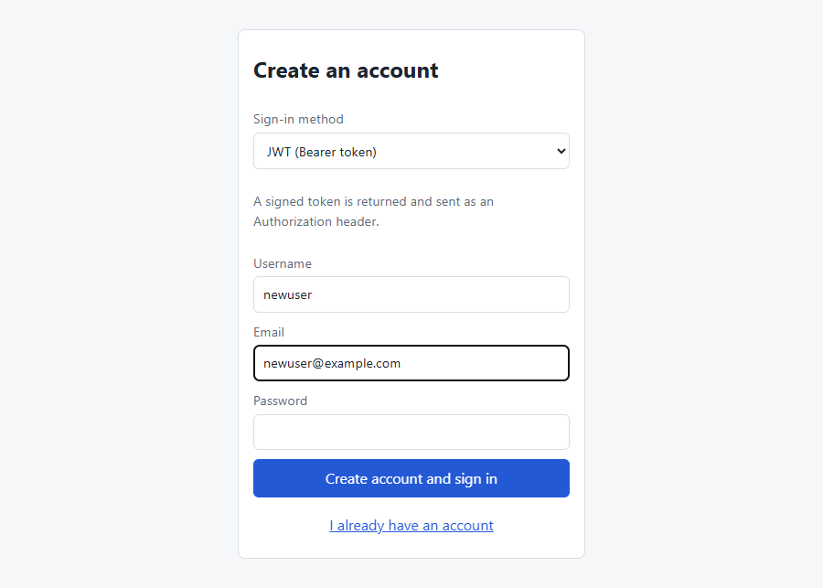
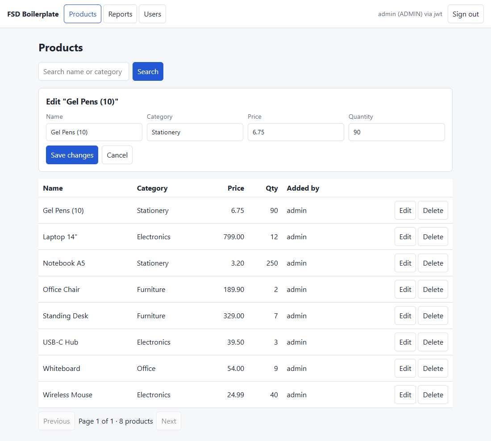
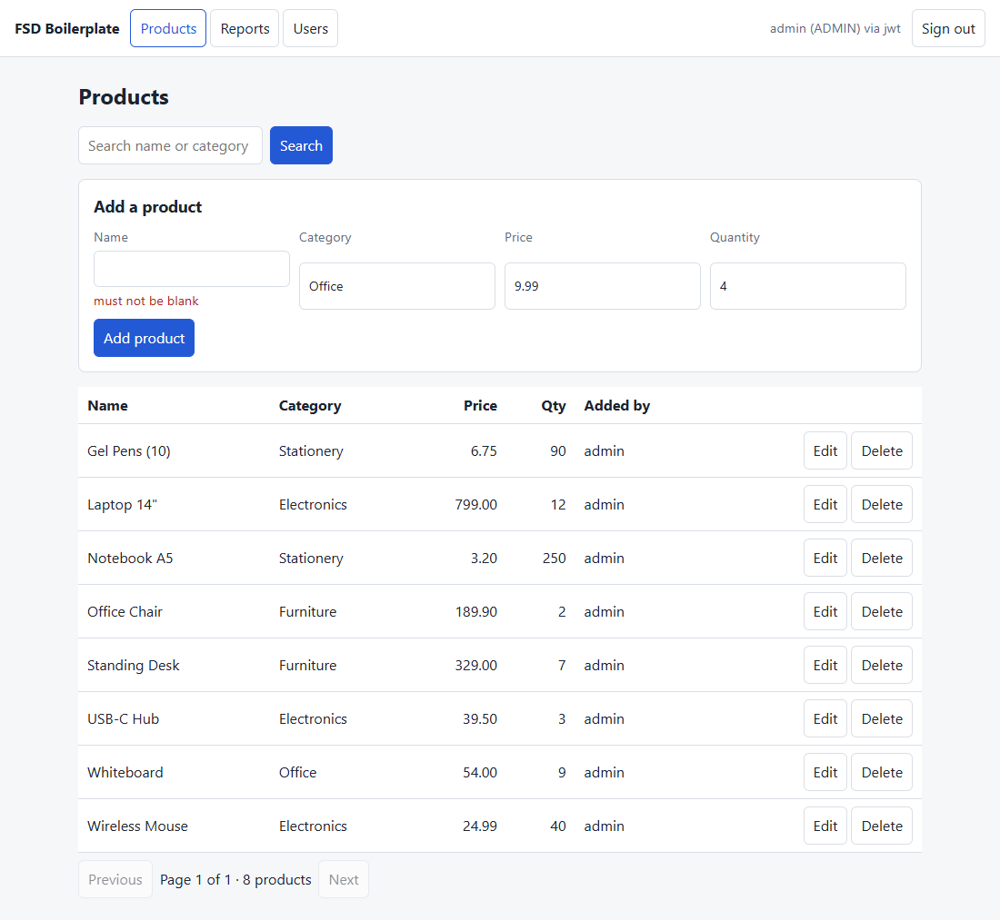
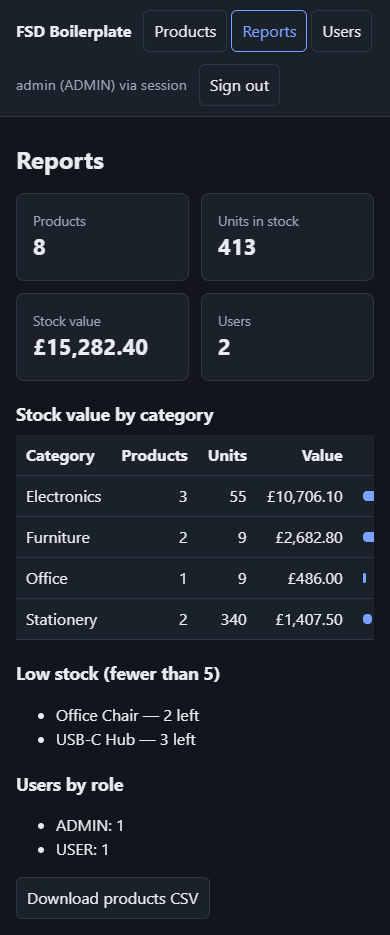

# FSD boilerplate: React + Spring Boot + MySQL

A small full-stack app with the pieces most projects need: user accounts, a CRUD data set,
three ways to sign in, role-based access and a report.

## Screenshots

Taken from the running app (Edge, local test database). Full-size files are in [docs/screenshots](docs/screenshots).

| Sign in | Wrong password | Create an account |
|---|---|---|
|  |  |  |

**Products, as ADMIN** (search, add form, paged table, Edit and Delete):


| Editing a product | A server error shown beside the field |
|---|---|
|  |  |

| Users (ADMIN only) | Reports with a CSV download |
|---|---|
|  |  |

**The same screen for a plain USER**: no Users tab, no Delete buttons.


**Phone width, dark colour scheme** (the table scrolls sideways inside its box):



## Run it

Needs MySQL 8, JDK 21, Maven and Node 20+. Docker is optional (see the end).

```bash
# 1. once: create the database and user (prompts for your MySQL root password)
mysql -u root -p -e "source db/01-create-database.sql"

# 2. API on http://localhost:8080 (tables are created on first start)
cd backend && mvn spring-boot:run

# 3. UI on http://localhost:5173
cd frontend && npm install && npm run dev
```

Settings come from environment variables (`DB_URL`, `DB_USER`, `DB_PASSWORD`, `JWT_SECRET`,
`ADMIN_PASSWORD`, `USER_PASSWORD`, `COOKIE_SECURE`). The defaults in `application.yml` are for
local development only.

Optional: `docker compose up --build -d` runs MySQL (port 3307) and the API in containers.

Seeded logins (change them via `ADMIN_PASSWORD` / `USER_PASSWORD`):

| User | Password | Role |
|---|---|---|
| admin | Admin#12345 | ADMIN |
| demo | User#12345 | USER |

## What is where

| Need | Where |
|---|---|
| Login, register, logout, "who am I" | `AuthController` |
| Users CRUD (admin only) | `UserController`, `UsersPage.tsx` |
| Data CRUD (products) | `ProductController`, `ProductsPage.tsx` |
| Reporting + CSV export | `ReportController`, `ReportsPage.tsx` |
| Security rules | `SecurityConfig` |
| Token create/verify | `JwtService` |
| Every HTTP call from the UI | `frontend/src/api.ts` |

## Three auth modes

All three are live at once and every protected endpoint accepts any of them.

| Mode | Login endpoint | How the browser proves itself | State lives |
|---|---|---|---|
| JWT | `POST /api/auth/jwt/login` | `Authorization: Bearer <token>` | the client |
| Cookie | `POST /api/auth/cookie/login` | HttpOnly `access_token` cookie holding the JWT | the client |
| Session | `POST /api/auth/session/login` | `JSESSIONID` cookie | the server |

Logout (`POST /api/auth/logout`) destroys a session on the server, so a copied session cookie stops
working. A JWT and the cookie that holds one are stateless: logout clears the cookie, but a copy of
either keeps working until it expires (60 minutes). Revoking them needs a server-side list.

## Access rules

| Endpoint | Who |
|---|---|
| `/api/auth/register`, `/api/auth/*/login` | anyone |
| `/api/products` read, create, update | any signed-in user |
| `DELETE /api/products/{id}` | ADMIN |
| `/api/users/**`, `/api/reports/users` | ADMIN |
| everything else under `/api` | any signed-in user |

## Before real use

- Set `JWT_SECRET` (32+ bytes) and the seed passwords. Set `COOKIE_SECURE=true` behind HTTPS.
- CSRF protection is off because the UI and API share an origin and cookies are `SameSite=Lax`.
  Turn it on before serving the API to any other origin.
- `ddl-auto: update` creates the tables for you. Move to Flyway or Liquibase for production.
- No login rate limiting or account lockout yet.

## What was verified

On 2026-10-09 the whole app was run against a throwaway MySQL 8 and exercised, through the HTTP API with
`curl` and through the UI in a real Edge browser:

- Register (201, and 409 for a duplicate), and sign-in in all three modes; each stays signed in after a
  page reload and ends on sign-out.
- Products: list, search, paging, create, edit and delete as ADMIN; a USER can read, create and edit but
  gets 403 on delete; a blank name or a negative price or quantity returns 400 with a message per field.
- Users (ADMIN only): create, disable (a disabled user cannot sign in), change role, delete; an admin
  cannot demote, disable or delete their own account; a USER gets 403 and an anonymous caller 401.
- Reports: totals, stock by category, low stock and users by role (ADMIN only), and the CSV download.

Not covered: there are no automated API or UI tests, only 5 unit tests for the JWT code.
Two small UI bugs were found while taking the screenshots and fixed: the sign-in error stayed on screen
after switching to "Create an account", and the report bars were squashed on a phone.
